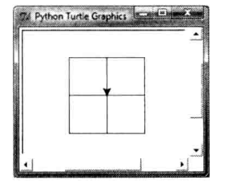
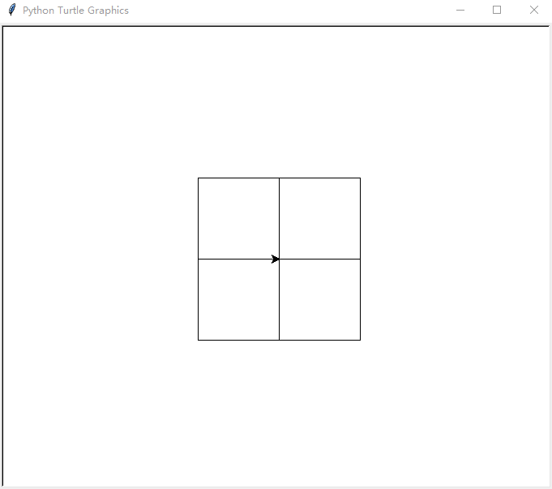
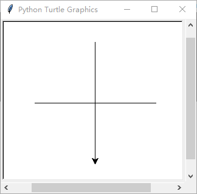
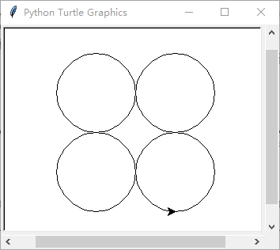
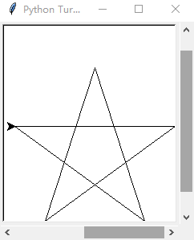
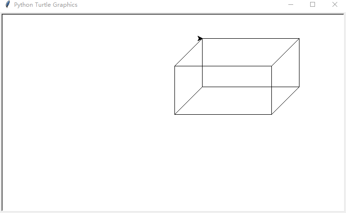

# day 1 习题

## 1.2

**题目**：（显示同样的消息五次）编写程序显示"Welcome to Python" 五次。

**代码**

``` python
for i in range(5):
    print("Welcome to Python.")
```

## 1.4

**题目**：（打印表格）编写程序显示下面的表格

```
a       a^2     a^3
1       1       1
2       4       8
3       9       27
4       16      64
```

**代码**
``` python
print('a\ta^2\ta^3')
    for i in range(n):
        print(str(i) + '\t' 
            + str(i**2) + '\t' 
            + str(i**3))
```

## 1.6

**题目**：（级数求和）编写程序显示 $1+2+3+4+5+6+7+8+9$ 的和。

**代码**：

``` python
sum = 0
for i in range(1, n+1):
    sum += i
    return sum
```

## 1.8

**题目**：（圆的面积和周长）使用下面的公式编写程序，显示半径是 5.5 的圆的面积和周长
$$
area = radius \times radius \times \pi \\
perimeter = 2 \times radius \times \pi
$$
**代码**

``` python
PI = 3.14
r = 5.5
area = r * r * PI
perimeter = 2 * r * PI
print('area is', area)
print('perimeter is', perimeter)
# area is 94.985
# perimeter is 34.54
```

## 1.10

**题目**：（平均速度）假设一个人在 45 分 30 秒内跑了 14 公里，编写程序显示每小时的平均速度是多少英里。（1 英里是 1.6 公里）

**代码**

``` python
time = (45 * 60 + 30) / (60 * 60)
dist = 14 / 1.6
print("mph is", time/dist)
# mph is 11.538461538461538
```

## 1.12

**题目**：（Turtle：绘制正方形）编写程序在屏幕中心绘制正方形，如图所示



**代码**

``` python
import turtle as t
for i in range(4):
    for i in range(3):
                t.forward(100)
                t.right(90)
            t.forward(100)
t.done()
```



## 1.13
**题目**：（Turtle：绘制十字）编写程序画出十字。
**代码**
``` python
t.penup()
t.forward(100)
t.pendown()
t.right(180)
t.forward(200)
t.penup()
t.goto(0, 100)
t.pendown()
t.left(90)
t.forward(200)
t.done()
```


## 1.14 
**题目**：（Turtle：绘制三角形）编写程序画出三角形。
**代码**
``` python
t.forward(100)
t.left(120)
t.forward(200)
t.left(120)
t.forward(200)
t.left(120)
t.forward(100)
```


## 1.16
**题目**：（Turtle：绘制四个圆）编写程序画出四个圆
**代码**
``` python
t.penup()
t.goto(-50, 0)
t.pendown()
t.circle(50)

t.penup()
t.goto(50, 0)
t.pendown()
t.circle(50)

t.penup()
t.goto(-50, -100)
t.pendown()
t.circle(50, -100)
# 其实 circle(-100) 可以顺时针画出一个圆来
```



## 1.18
**题目**：（Turtle：绘制五角星）编写程序绘制一个五角星。
**代码**
``` python
for i in range(5):
	t.forward(200)
	t.right(144)
```



## 1.20
**题目**：（Turtle：显示立方体）编写程序显示一个立方体。
**代码**
``` python
for i in range(2):
    t.forward(200)
    t.left(90)
    t.forward(100)
    t.left(90)
t.left(45)
t.forward(80)
t.penup()
t.goto(200, 0)
t.pendown()
t.forward(80)
t.penup()
t.goto(200, 100)
t.pendown()
t.forward(80)
t.penup()
t.goto(0, 100)
t.pendown()
t.forward(80)
t.right(45)
for i in range(2):
    t.forward(200)
    t.right(90)
    t.forward(100)
    t.right(90)
```



